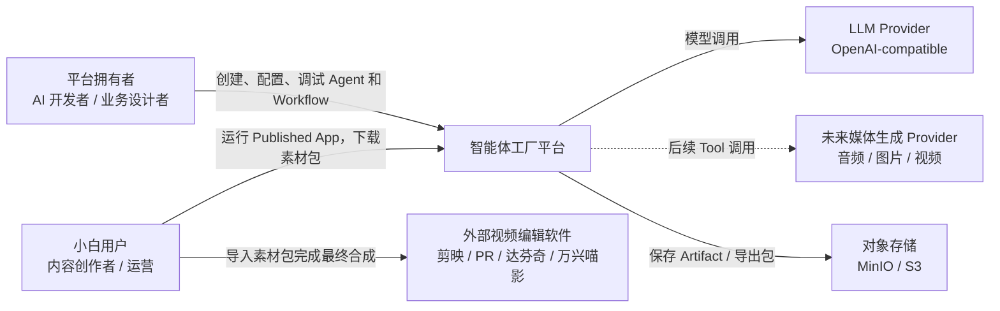
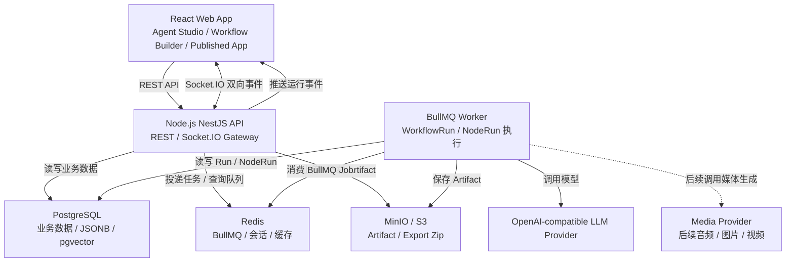
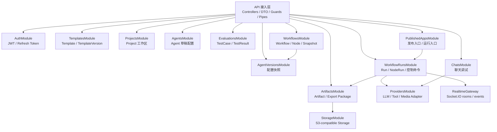
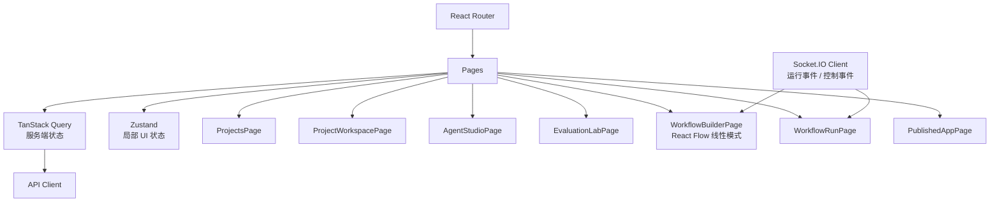
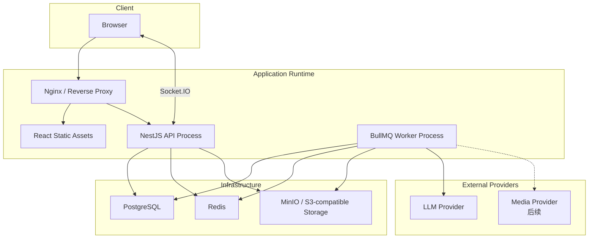
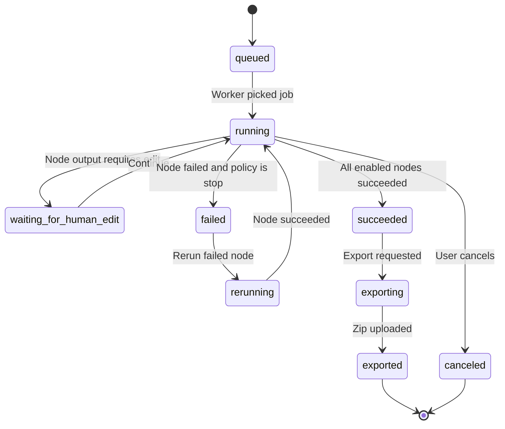

# 智能体工厂平台架构图

## 1. 来龙去脉

一句话：智能体工厂平台让 AI 开发者创建、调试、版本化和编排多个智能体，并将成熟工作流发布成小白用户可运行的业务应用。

解决的问题：避免把复杂 AI 生产流程写死成一次性工具，而是沉淀为可调优、可复用、可追踪、可发布的多智能体业务流程。

上下游：

- 上游：平台拥有者、小白用户、Published App 入口、外部模型供应商。
- 下游：PostgreSQL、Redis/BullMQ、MinIO/S3、LLM Provider、未来媒体生成 Provider、外部视频编辑软件。

## 2. C4 Level 1：系统上下文图

## 3. C4 Level 2：容器图

## 4. C4 Level 3：后端模块图

## 5. 前端模块图

## 6. 部署架构图

## 7. 数据流图

```mermaid
flowchart LR
  input["用户输入<br/>小说 / 故事 / 参数"]
  published["Published App<br/>公开输入 schema"]
  snapshot["WorkflowSnapshot<br/>发布快照"]
  queue["BullMQ Job"]
  runner["Workflow Worker"]
  llm["LLM Provider"]
  nodeOutput["WorkflowNodeRun Output"]
  artifact["Artifact Metadata"]
  object["MinIO / S3 Object"]
  exportZip["Export Package Zip"]
  editor["外部视频编辑软件"]

  input --> published
  published --> snapshot
  snapshot --> queue
  queue --> runner
  runner --> llm
  llm --> nodeOutput
  nodeOutput --> artifact
  artifact --> object
  object --> exportZip
  exportZip --> editor
```

## 8. 核心状态图：WorkflowRun

## 9. 架构一致性要求

- MVP 使用 React Flow，但只开放线性模式，不使用普通列表替代未来画布。
- MVP 使用 Socket.IO，不使用 SSE 或轮询作为主要实时方案。
- MVP 使用 BullMQ + Redis，不使用同步 HTTP 长请求执行工作流。
- MVP 使用 S3 兼容 StorageProvider，开发默认 MinIO，不硬编码本地文件路径。
- MVP 使用 JWT + Refresh Token，只是先限制为单组织单管理员。
- Published App 绑定 WorkflowSnapshot，不直接绑定可编辑 Workflow 草稿。
