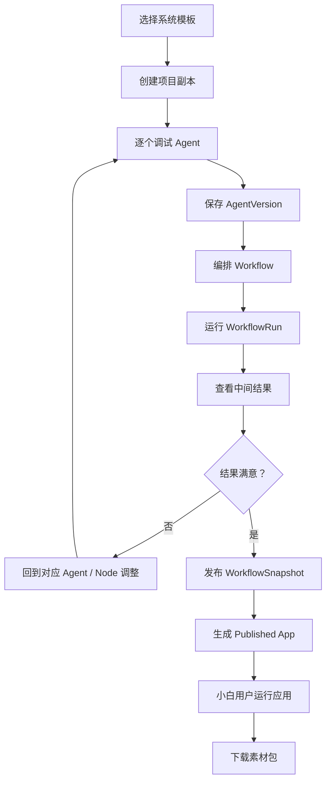
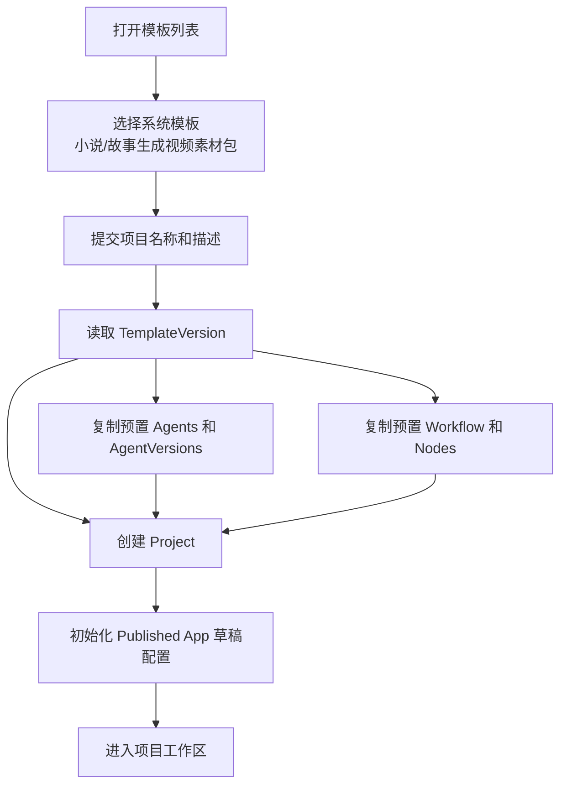
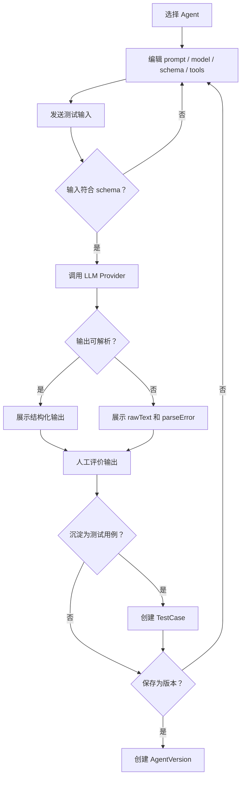
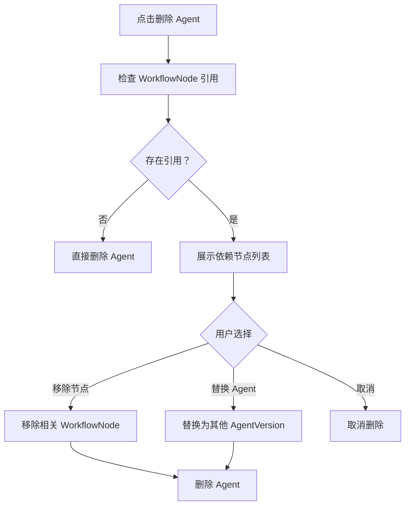
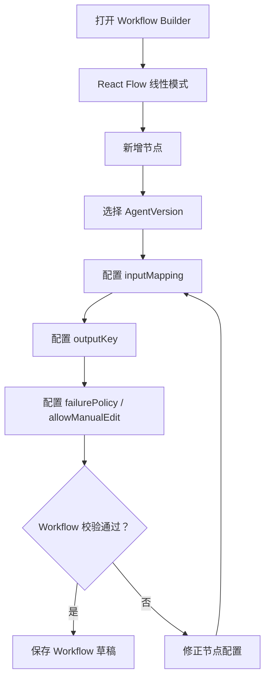
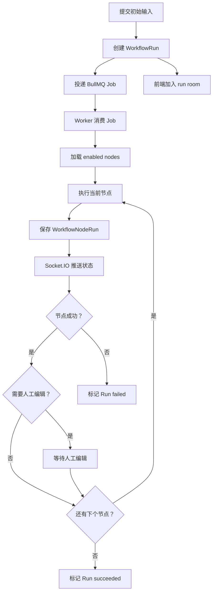
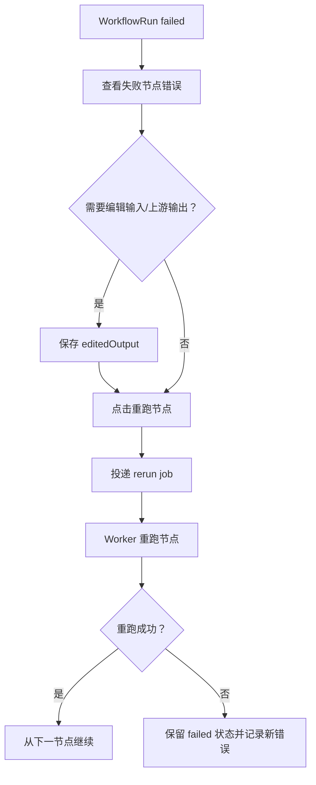
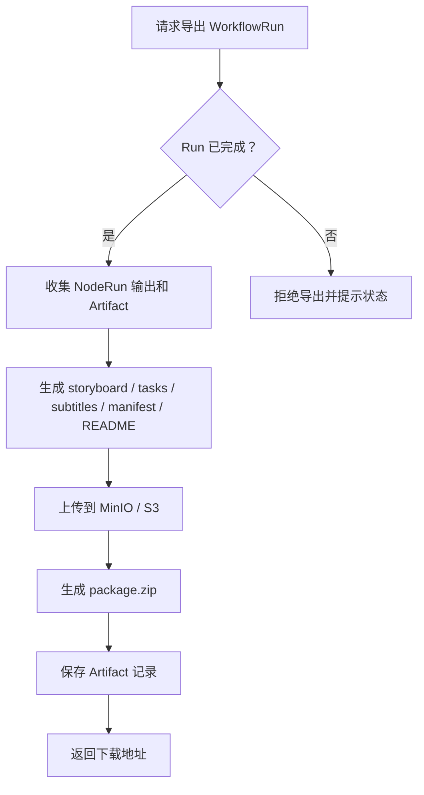
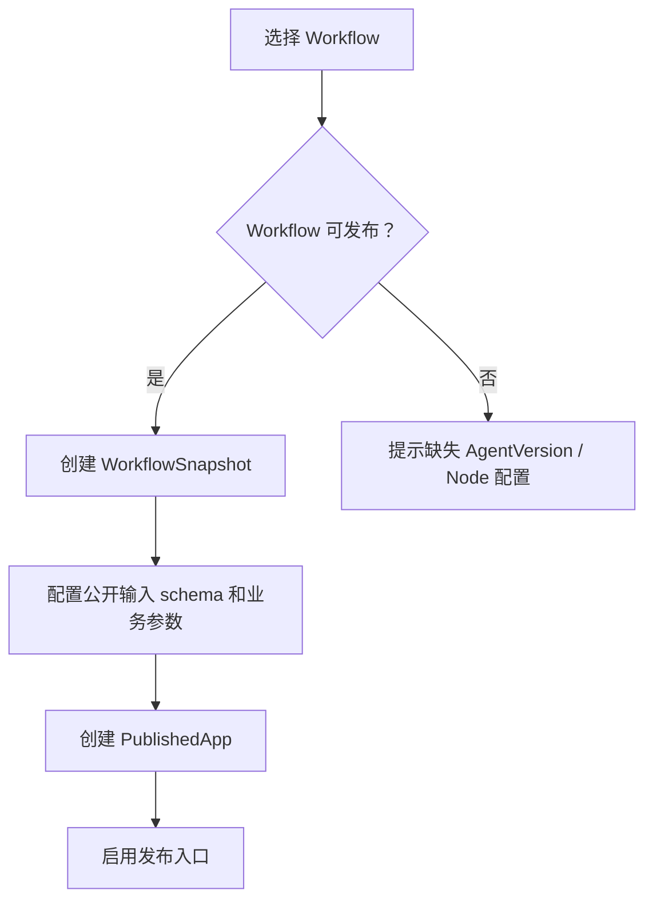
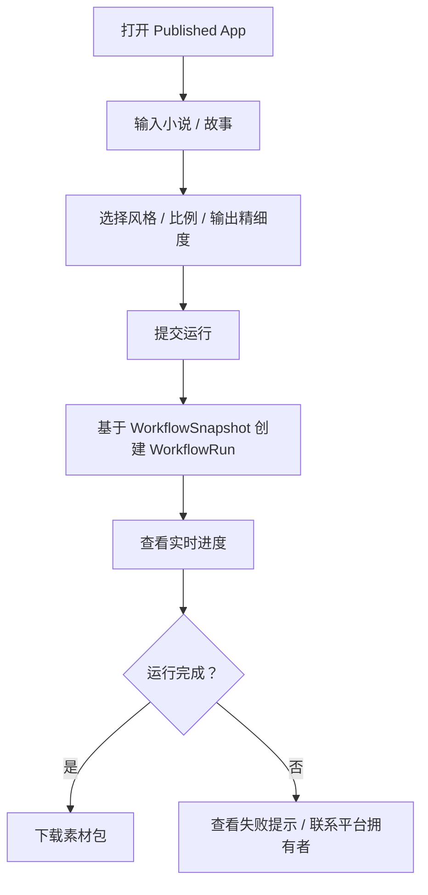

# 智能体工厂平台流程图

## 1. 总业务闭环

## 2. 基于模板创建项目流程

## 3. Agent 聊天调试流程

## 4. Agent 删除流程

## 5. Workflow 编排流程

## 6. WorkflowRun 执行流程

## 7. 失败节点重跑流程

## 8. 导出素材包流程

## 9. Published App 发布流程

## 10. 小白用户运行 Published App 流程

