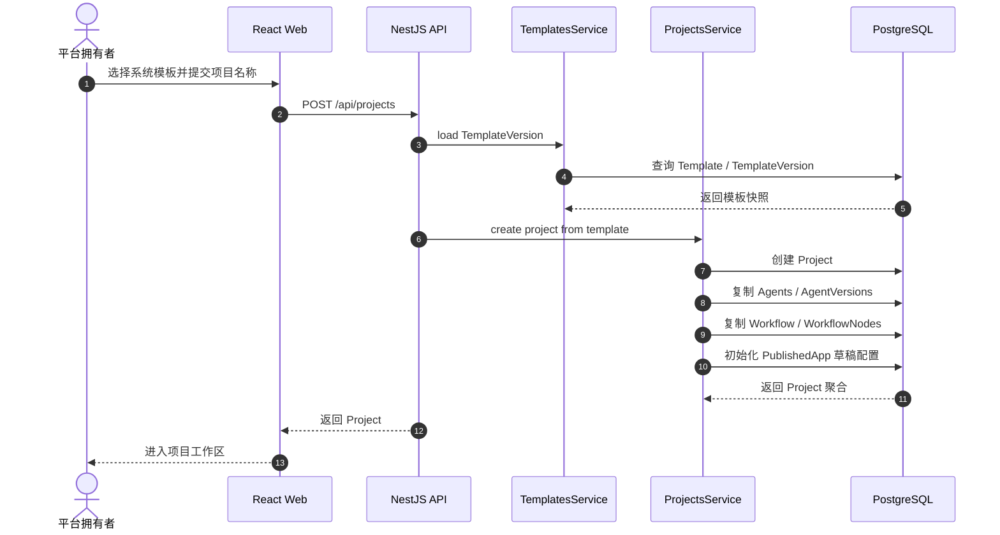
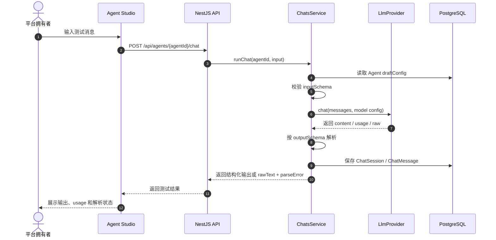
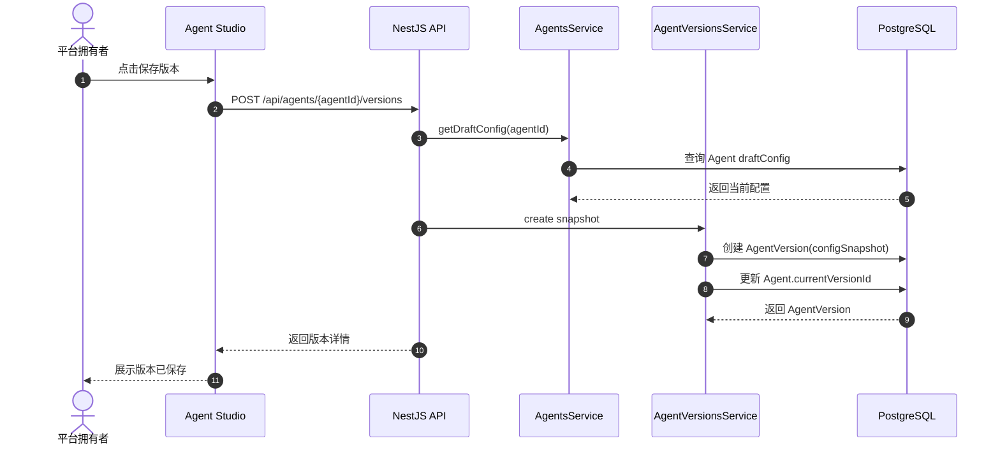
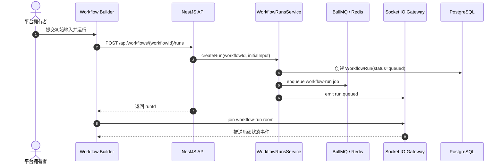
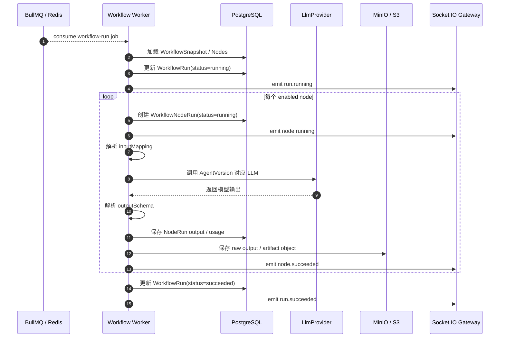
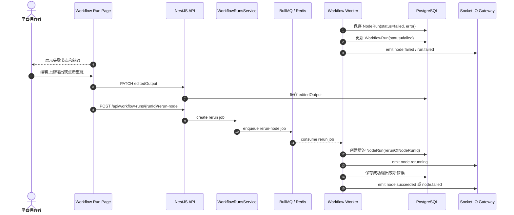
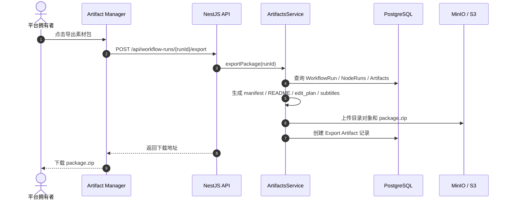
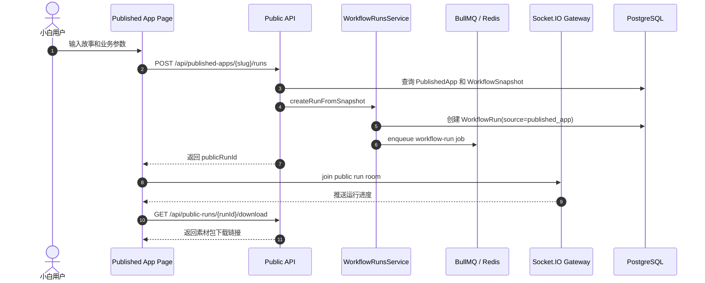
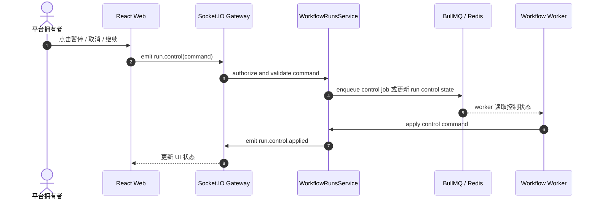

# 智能体工厂平台时序图

## 1. 基于模板创建项目

```mermaid
sequenceDiagram
  autonumber
  actor Owner as 平台拥有者
  participant Web as React Web
  participant API as NestJS API
  participant Templates as TemplatesService
  participant Projects as ProjectsService
  participant DB as PostgreSQL

  Owner->>Web: 选择系统模板并提交项目名称
  Web->>API: POST /api/projects
  API->>Templates: load TemplateVersion
  Templates->>DB: 查询 Template / TemplateVersion
  DB-->>Templates: 返回模板快照
  API->>Projects: create project from template
  Projects->>DB: 创建 Project
  Projects->>DB: 复制 Agents / AgentVersions
  Projects->>DB: 复制 Workflow / WorkflowNodes
  Projects->>DB: 初始化 PublishedApp 草稿配置
  DB-->>Projects: 返回 Project 聚合
  API-->>Web: 返回 Project
  Web-->>Owner: 进入项目工作区
```

## 2. Agent 聊天调试

```mermaid
sequenceDiagram
  autonumber
  actor Owner as 平台拥有者
  participant Web as Agent Studio
  participant API as NestJS API
  participant Chats as ChatsService
  participant Providers as LlmProvider
  participant DB as PostgreSQL

  Owner->>Web: 输入测试消息
  Web->>API: POST /api/agents/{agentId}/chat
  API->>Chats: runChat(agentId, input)
  Chats->>DB: 读取 Agent draftConfig
  Chats->>Chats: 校验 inputSchema
  Chats->>Providers: chat(messages, model config)
  Providers-->>Chats: 返回 content / usage / raw
  Chats->>Chats: 按 outputSchema 解析
  Chats->>DB: 保存 ChatSession / ChatMessage
  Chats-->>API: 返回结构化输出或 rawText + parseError
  API-->>Web: 返回测试结果
  Web-->>Owner: 展示输出、usage 和解析状态
```

## 3. 保存 AgentVersion

```mermaid
sequenceDiagram
  autonumber
  actor Owner as 平台拥有者
  participant Web as Agent Studio
  participant API as NestJS API
  participant Agents as AgentsService
  participant Versions as AgentVersionsService
  participant DB as PostgreSQL

  Owner->>Web: 点击保存版本
  Web->>API: POST /api/agents/{agentId}/versions
  API->>Agents: getDraftConfig(agentId)
  Agents->>DB: 查询 Agent draftConfig
  DB-->>Agents: 返回当前配置
  API->>Versions: create snapshot
  Versions->>DB: 创建 AgentVersion(configSnapshot)
  Versions->>DB: 更新 Agent.currentVersionId
  DB-->>Versions: 返回 AgentVersion
  API-->>Web: 返回版本详情
  Web-->>Owner: 展示版本已保存
```

## 4. 创建并运行 WorkflowRun

```mermaid
sequenceDiagram
  autonumber
  actor Owner as 平台拥有者
  participant Web as Workflow Builder
  participant API as NestJS API
  participant Runs as WorkflowRunsService
  participant Queue as BullMQ / Redis
  participant Socket as Socket.IO Gateway
  participant DB as PostgreSQL

  Owner->>Web: 提交初始输入并运行
  Web->>API: POST /api/workflows/{workflowId}/runs
  API->>Runs: createRun(workflowId, initialInput)
  Runs->>DB: 创建 WorkflowRun(status=queued)
  Runs->>Queue: enqueue workflow-run job
  Runs->>Socket: emit run.queued
  API-->>Web: 返回 runId
  Web->>Socket: join workflow-run room
  Socket-->>Web: 推送后续状态事件
```

## 5. Worker 执行节点

```mermaid
sequenceDiagram
  autonumber
  participant Queue as BullMQ / Redis
  participant Worker as Workflow Worker
  participant DB as PostgreSQL
  participant Providers as LlmProvider
  participant Storage as MinIO / S3
  participant Socket as Socket.IO Gateway

  Queue-->>Worker: consume workflow-run job
  Worker->>DB: 加载 WorkflowSnapshot / Nodes
  Worker->>DB: 更新 WorkflowRun(status=running)
  Worker->>Socket: emit run.running
  loop 每个 enabled node
    Worker->>DB: 创建 WorkflowNodeRun(status=running)
    Worker->>Socket: emit node.running
    Worker->>Worker: 解析 inputMapping
    Worker->>Providers: 调用 AgentVersion 对应 LLM
    Providers-->>Worker: 返回模型输出
    Worker->>Worker: 解析 outputSchema
    Worker->>DB: 保存 NodeRun output / usage
    Worker->>Storage: 保存 raw output / artifact object
    Worker->>Socket: emit node.succeeded
  end
  Worker->>DB: 更新 WorkflowRun(status=succeeded)
  Worker->>Socket: emit run.succeeded
```

## 6. 节点失败与重跑

```mermaid
sequenceDiagram
  autonumber
  actor Owner as 平台拥有者
  participant Web as Workflow Run Page
  participant API as NestJS API
  participant Runs as WorkflowRunsService
  participant Queue as BullMQ / Redis
  participant Worker as Workflow Worker
  participant DB as PostgreSQL
  participant Socket as Socket.IO Gateway

  Worker->>DB: 保存 NodeRun(status=failed, error)
  Worker->>DB: 更新 WorkflowRun(status=failed)
  Worker->>Socket: emit node.failed / run.failed
  Web-->>Owner: 展示失败节点和错误
  Owner->>Web: 编辑上游输出或点击重跑
  Web->>API: PATCH editedOutput
  API->>DB: 保存 editedOutput
  Web->>API: POST /api/workflow-runs/{runId}/rerun-node
  API->>Runs: create rerun job
  Runs->>Queue: enqueue rerun-node job
  Queue-->>Worker: consume rerun job
  Worker->>DB: 创建新的 NodeRun(rerunOfNodeRunId)
  Worker->>Socket: emit node.rerunning
  Worker->>DB: 保存成功输出或新错误
  Worker->>Socket: emit node.succeeded 或 node.failed
```

## 7. 导出素材包

```mermaid
sequenceDiagram
  autonumber
  actor Owner as 平台拥有者
  participant Web as Artifact Manager
  participant API as NestJS API
  participant Artifacts as ArtifactsService
  participant DB as PostgreSQL
  participant Storage as MinIO / S3

  Owner->>Web: 点击导出素材包
  Web->>API: POST /api/workflow-runs/{runId}/export
  API->>Artifacts: exportPackage(runId)
  Artifacts->>DB: 查询 WorkflowRun / NodeRuns / Artifacts
  Artifacts->>Artifacts: 生成 manifest / README / edit_plan / subtitles
  Artifacts->>Storage: 上传目录对象和 package.zip
  Artifacts->>DB: 创建 Export Artifact 记录
  API-->>Web: 返回下载地址
  Web-->>Owner: 下载 package.zip
```

## 8. Published App 运行

```mermaid
sequenceDiagram
  autonumber
  actor User as 小白用户
  participant App as Published App Page
  participant API as Public API
  participant Runs as WorkflowRunsService
  participant Queue as BullMQ / Redis
  participant Socket as Socket.IO Gateway
  participant DB as PostgreSQL

  User->>App: 输入故事和业务参数
  App->>API: POST /api/published-apps/{slug}/runs
  API->>DB: 查询 PublishedApp 和 WorkflowSnapshot
  API->>Runs: createRunFromSnapshot
  Runs->>DB: 创建 WorkflowRun(source=published_app)
  Runs->>Queue: enqueue workflow-run job
  API-->>App: 返回 publicRunId
  App->>Socket: join public run room
  Socket-->>App: 推送运行进度
  App->>API: GET /api/public-runs/{runId}/download
  API-->>App: 返回素材包下载链接
```

## 9. Socket.IO 运行控制

```mermaid
sequenceDiagram
  autonumber
  actor Owner as 平台拥有者
  participant Web as React Web
  participant Socket as Socket.IO Gateway
  participant Runs as WorkflowRunsService
  participant Queue as BullMQ / Redis
  participant Worker as Workflow Worker

  Owner->>Web: 点击暂停 / 取消 / 继续
  Web->>Socket: emit run.control(command)
  Socket->>Runs: authorize and validate command
  Runs->>Queue: enqueue control job 或更新 run control state
  Queue-->>Worker: worker 读取控制状态
  Worker->>Runs: apply control command
  Runs->>Socket: emit run.control.applied
  Socket-->>Web: 更新 UI 状态
```
