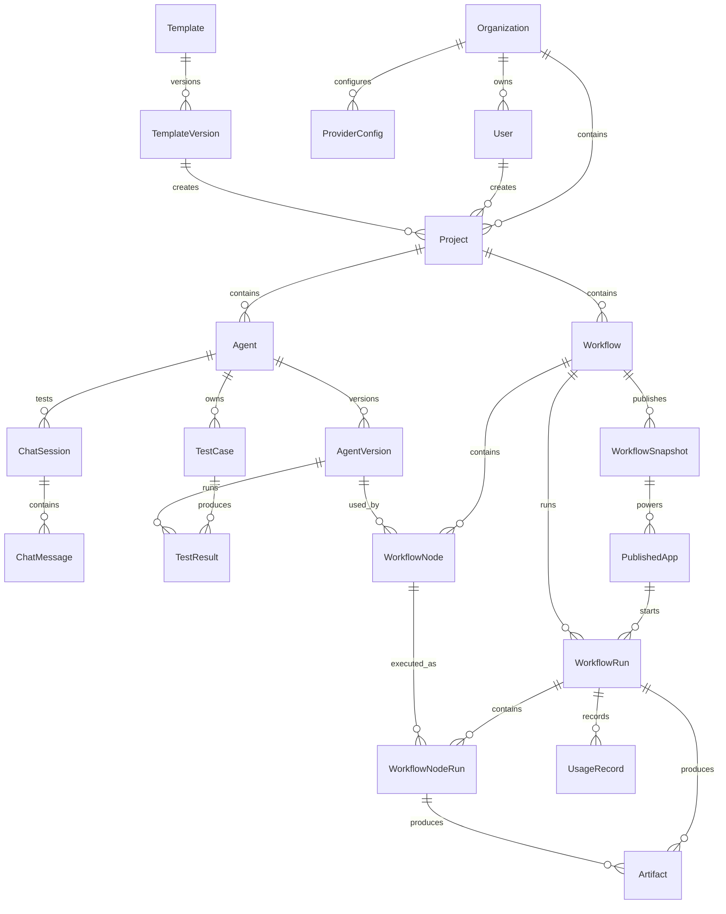
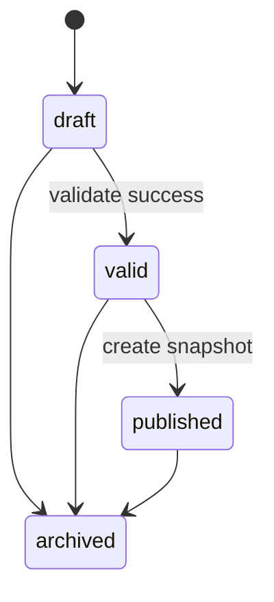
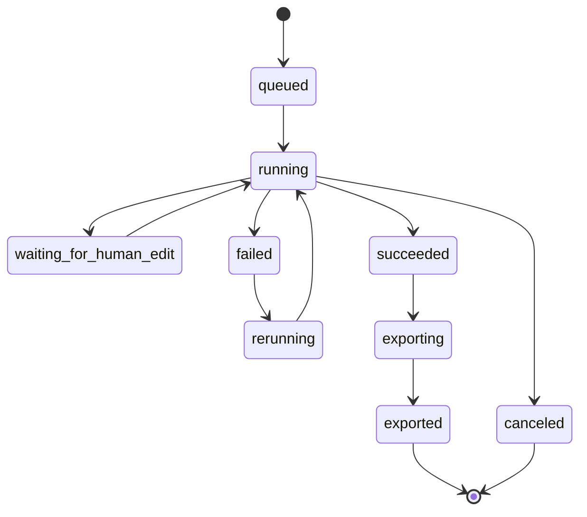
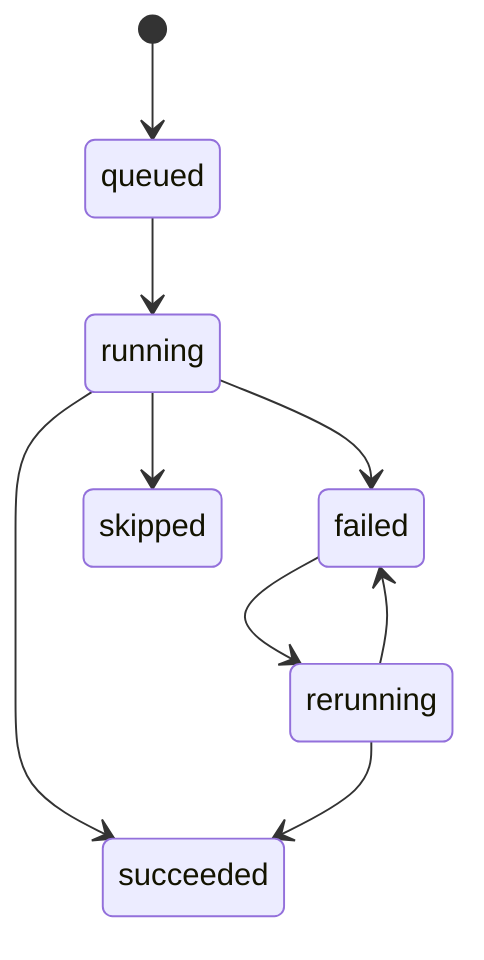
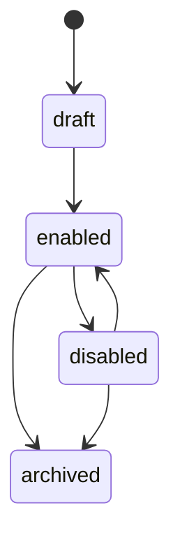

# 智能体工厂平台数据结构文档

## 1. 数据模型原则

- 所有核心配置必须版本化，避免运行不可复现。
- WorkflowNode 绑定 AgentVersion，而不是绑定可变 Agent 草稿。
- PublishedApp 绑定 WorkflowSnapshot，而不是绑定可编辑 Workflow 草稿。
- Artifact 保存对象存储 key，不保存本地绝对路径。
- WorkflowRun 和 WorkflowNodeRun 必须保留输入、输出、错误、usage 和状态变化，便于调试、回放和计量。
- MVP 可以只有单组织单管理员，但数据结构保留 Organization / User / Membership，避免后续重构。

## 2. ER 图



## 3. 核心实体说明

| 实体 | 说明 |
| --- | --- |
| Organization | 组织。MVP 可以只有默认组织，但从第一版保留组织边界。 |
| User | 用户。MVP 可以只有管理员用户。 |
| ProviderConfig | 模型供应商配置，只保存 apiKeyRef，不保存明文 key。 |
| Template | 模板元信息，例如小说视频素材生产模板。 |
| TemplateVersion | 模板版本快照，包含预置 Agent、Workflow、Published App 草稿配置。 |
| Project | 项目工作区，由模板创建或手动创建。 |
| Agent | 可配置原子智能体，保存草稿配置。 |
| AgentVersion | Agent 稳定配置快照。WorkflowNode 必须绑定该对象。 |
| ChatSession | Agent 聊天调试会话。 |
| TestCase | Agent 测试用例。 |
| TestResult | 某个 AgentVersion 在某个 TestCase 下的输出和人工评分。 |
| Workflow | 可编辑工作流草稿。 |
| WorkflowNode | Workflow 中的节点，MVP 用 React Flow 线性模式呈现。 |
| WorkflowSnapshot | 发布快照，冻结 Workflow 和节点配置。 |
| PublishedApp | 小白用户入口，绑定 WorkflowSnapshot。 |
| WorkflowRun | 一次运行实例，由 BullMQ 调度。 |
| WorkflowNodeRun | 一次节点执行记录。 |
| Artifact | 运行产生的结构化输出、导出文件或未来媒体素材。 |
| UsageRecord | token、耗时、模型、产物数量等计量记录。 |

## 4. 状态机

### 4.1 Workflow 状态



### 4.2 WorkflowRun 状态



### 4.3 WorkflowNodeRun 状态



### 4.4 PublishedApp 状态



## 5. Prisma Schema 草案

```prisma
model Organization {
  id        String   @id @default(cuid())
  name      String
  createdAt DateTime @default(now())
  updatedAt DateTime @updatedAt

  users           User[]
  projects        Project[]
  providerConfigs ProviderConfig[]
}

model User {
  id             String   @id @default(cuid())
  organizationId String
  email          String   @unique
  passwordHash   String
  name           String?
  role           String   @default("admin")
  createdAt      DateTime @default(now())
  updatedAt      DateTime @updatedAt

  organization   Organization @relation(fields: [organizationId], references: [id])
  projects       Project[]
}

model ProviderConfig {
  id             String   @id @default(cuid())
  organizationId String
  name           String
  type           String
  baseUrl        String?
  apiKeyRef      String
  metadata       Json?
  createdAt      DateTime @default(now())
  updatedAt      DateTime @updatedAt

  organization   Organization @relation(fields: [organizationId], references: [id])
}

model Template {
  id          String   @id @default(cuid())
  name        String
  description String?
  type        String
  status      String   @default("active")
  createdAt   DateTime @default(now())
  updatedAt   DateTime @updatedAt

  versions    TemplateVersion[]
}

model TemplateVersion {
  id          String   @id @default(cuid())
  templateId  String
  versionName String
  snapshot    Json
  createdAt   DateTime @default(now())

  template    Template @relation(fields: [templateId], references: [id])
  projects    Project[]
}

model Project {
  id                String   @id @default(cuid())
  organizationId    String
  createdByUserId   String?
  templateVersionId String?
  name              String
  description       String?
  createdAt         DateTime @default(now())
  updatedAt         DateTime @updatedAt

  organization      Organization     @relation(fields: [organizationId], references: [id])
  createdBy         User?            @relation(fields: [createdByUserId], references: [id])
  templateVersion   TemplateVersion? @relation(fields: [templateVersionId], references: [id])
  agents            Agent[]
  workflows         Workflow[]
  artifacts         Artifact[]
}

model Agent {
  id               String   @id @default(cuid())
  projectId        String
  name             String
  description      String?
  draftConfig      Json
  currentVersionId String?
  createdAt        DateTime @default(now())
  updatedAt        DateTime @updatedAt

  project          Project @relation(fields: [projectId], references: [id])
  versions         AgentVersion[]
  chatSessions     ChatSession[]
  testCases        TestCase[]
}

model AgentVersion {
  id             String   @id @default(cuid())
  agentId        String
  versionName    String
  configSnapshot Json
  notes          String?
  createdAt      DateTime @default(now())

  agent          Agent @relation(fields: [agentId], references: [id])
  workflowNodes  WorkflowNode[]
  testResults    TestResult[]
}

model ChatSession {
  id        String   @id @default(cuid())
  agentId   String
  title     String?
  createdAt DateTime @default(now())
  updatedAt DateTime @updatedAt

  agent     Agent @relation(fields: [agentId], references: [id])
  messages  ChatMessage[]
}

model ChatMessage {
  id            String   @id @default(cuid())
  chatSessionId String
  role          String
  content       String
  metadata      Json?
  createdAt     DateTime @default(now())

  chatSession   ChatSession @relation(fields: [chatSessionId], references: [id])
}

model TestCase {
  id                       String   @id @default(cuid())
  projectId                 String
  agentId                   String
  name                      String
  input                     Json
  expectedNotes             String?
  createdFromChatMessageId  String?
  createdAt                 DateTime @default(now())

  agent                     Agent @relation(fields: [agentId], references: [id])
  results                   TestResult[]
}

model TestResult {
  id             String   @id @default(cuid())
  testCaseId     String
  agentVersionId String
  output         Json
  rating         String?
  notes          String?
  usage          Json?
  createdAt      DateTime @default(now())

  testCase       TestCase     @relation(fields: [testCaseId], references: [id])
  agentVersion   AgentVersion @relation(fields: [agentVersionId], references: [id])
}

model Workflow {
  id          String   @id @default(cuid())
  projectId   String
  name        String
  description String?
  status      String   @default("draft")
  createdAt   DateTime @default(now())
  updatedAt   DateTime @updatedAt

  project     Project @relation(fields: [projectId], references: [id])
  nodes       WorkflowNode[]
  snapshots   WorkflowSnapshot[]
  runs        WorkflowRun[]
}

model WorkflowNode {
  id              String   @id @default(cuid())
  workflowId      String
  orderIndex      Int
  name            String
  type            String   @default("agent")
  agentVersionId  String?
  position        Json?
  inputMapping    Json
  outputKey       String
  allowManualEdit Boolean  @default(true)
  failurePolicy   String   @default("stop")
  enabled         Boolean  @default(true)

  workflow        Workflow      @relation(fields: [workflowId], references: [id])
  agentVersion    AgentVersion? @relation(fields: [agentVersionId], references: [id])
  nodeRuns        WorkflowNodeRun[]
}

model WorkflowSnapshot {
  id          String   @id @default(cuid())
  workflowId  String
  versionName String
  snapshot    Json
  notes       String?
  createdAt   DateTime @default(now())

  workflow    Workflow @relation(fields: [workflowId], references: [id])
  apps        PublishedApp[]
}

model PublishedApp {
  id                 String   @id @default(cuid())
  projectId           String
  workflowSnapshotId  String
  slug               String   @unique
  name               String
  description        String?
  publicInputSchema  Json
  publicParams       Json?
  branding           Json?
  accessPolicy       Json?
  status             String   @default("draft")
  createdAt          DateTime @default(now())
  updatedAt          DateTime @updatedAt

  workflowSnapshot   WorkflowSnapshot @relation(fields: [workflowSnapshotId], references: [id])
  runs               WorkflowRun[]
}

model WorkflowRun {
  id                 String    @id @default(cuid())
  projectId           String
  workflowId          String?
  workflowSnapshotId  String?
  publishedAppId      String?
  source              String
  status              String
  initialInput        Json
  controlState        Json?
  usage               Json?
  errorSummary        String?
  queuedAt            DateTime  @default(now())
  startedAt           DateTime?
  finishedAt          DateTime?

  workflow            Workflow?     @relation(fields: [workflowId], references: [id])
  publishedApp        PublishedApp? @relation(fields: [publishedAppId], references: [id])
  nodeRuns            WorkflowNodeRun[]
  artifacts           Artifact[]
  usageRecords        UsageRecord[]
}

model WorkflowNodeRun {
  id                String    @id @default(cuid())
  workflowRunId      String
  workflowNodeId     String?
  rerunOfNodeRunId   String?
  status            String
  input             Json
  output            Json?
  editedOutput      Json?
  rawOutput         String?
  parseError        Json?
  error             Json?
  usage             Json?
  startedAt         DateTime?
  finishedAt        DateTime?

  workflowRun       WorkflowRun  @relation(fields: [workflowRunId], references: [id])
  workflowNode      WorkflowNode? @relation(fields: [workflowNodeId], references: [id])
  artifacts         Artifact[]
}

model Artifact {
  id                 String   @id @default(cuid())
  projectId           String
  workflowRunId       String
  workflowNodeRunId   String?
  type               String
  objectKey          String
  filename           String?
  contentType        String?
  sizeBytes          Int?
  metadata           Json?
  createdAt          DateTime @default(now())

  project            Project @relation(fields: [projectId], references: [id])
  workflowRun        WorkflowRun @relation(fields: [workflowRunId], references: [id])
  workflowNodeRun    WorkflowNodeRun? @relation(fields: [workflowNodeRunId], references: [id])
}

model UsageRecord {
  id             String   @id @default(cuid())
  workflowRunId   String
  scope          String
  providerType   String?
  providerName   String?
  modelId        String?
  promptTokens   Int?
  completionTokens Int?
  totalTokens    Int?
  durationMs     Int?
  estimatedCost  Decimal?
  metadata       Json?
  createdAt      DateTime @default(now())

  workflowRun    WorkflowRun @relation(fields: [workflowRunId], references: [id])
}
```

## 6. 关键 JSON 结构

### 6.1 Agent draftConfig / AgentVersion configSnapshot

```json
{
  "systemPrompt": "你是小说分析智能体...",
  "provider": {
    "type": "openai-compatible",
    "providerConfigId": "provider_default",
    "modelId": "example-model"
  },
  "runtimeParams": {
    "temperature": 0.7,
    "maxTokens": 4096,
    "responseFormat": "json"
  },
  "inputSchema": {
    "type": "object",
    "required": ["text"],
    "properties": {
      "text": { "type": "string" }
    }
  },
  "outputSchema": {
    "type": "object",
    "required": ["summary", "characters"],
    "properties": {
      "summary": { "type": "string" },
      "characters": {
        "type": "array",
        "items": { "type": "object" }
      }
    }
  },
  "tools": [],
  "skills": []
}
```

### 6.2 WorkflowNode inputMapping

```json
{
  "source": "node_output",
  "nodeOutputKey": "novel_analysis",
  "path": "$",
  "target": "analysis"
}
```

### 6.3 WorkflowSnapshot snapshot

```json
{
  "workflow": {
    "id": "wf_123",
    "name": "小说视频素材生产流程"
  },
  "nodes": [
    {
      "id": "node_001",
      "orderIndex": 1,
      "name": "小说分析",
      "type": "agent",
      "agentVersionId": "av_001",
      "agentVersionSnapshot": {
        "versionName": "v1",
        "configSnapshot": {}
      },
      "inputMapping": {
        "source": "workflow_input",
        "path": "$.text",
        "target": "text"
      },
      "outputKey": "novel_analysis",
      "allowManualEdit": true,
      "failurePolicy": "stop"
    }
  ]
}
```

### 6.4 Artifact metadata

```json
{
  "source": {
    "workflowRunId": "run_123",
    "workflowNodeRunId": "noderun_123",
    "agentVersionId": "av_123",
    "nodeOutputKey": "storyboard_script"
  },
  "business": {
    "sceneId": "scene_001",
    "shotId": "shot_001",
    "assetRole": "storyboard"
  }
}
```

### 6.5 Usage metadata

```json
{
  "provider": "openai-compatible",
  "modelId": "example-model",
  "promptTokens": 1200,
  "completionTokens": 800,
  "totalTokens": 2000,
  "durationMs": 5300,
  "estimatedCost": null
}
```

## 7. 索引建议

MVP 推荐索引：

```text
User.email unique
Template.type
TemplateVersion.templateId
Project.organizationId
Project.templateVersionId
Agent.projectId
AgentVersion.agentId
Workflow.projectId
WorkflowNode.workflowId + orderIndex
WorkflowSnapshot.workflowId
PublishedApp.slug unique
PublishedApp.workflowSnapshotId
WorkflowRun.projectId + status
WorkflowRun.publishedAppId
WorkflowNodeRun.workflowRunId
WorkflowNodeRun.workflowNodeId
Artifact.workflowRunId
Artifact.workflowNodeRunId
UsageRecord.workflowRunId
```

## 8. 删除与约束规则

- Agent 被 WorkflowNode 引用时不能静默删除。
- AgentVersion 被 WorkflowSnapshot 引用后不可修改。
- WorkflowSnapshot 创建后不可修改，只能创建新快照。
- PublishedApp 只能切换到新的 WorkflowSnapshot，不能直接改旧快照。
- WorkflowRun 创建后 initialInput 不可修改。
- WorkflowNodeRun 的原始 output 不应被覆盖，人工修正写入 editedOutput。
- Artifact objectKey 不应复用，导出包重新生成时创建新 Artifact。
- ProviderConfig 不保存明文 key，只保存 apiKeyRef。
